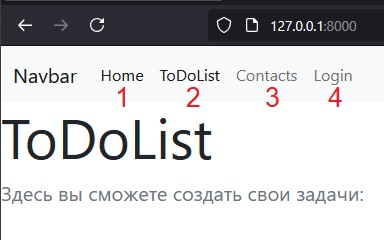

# Проектная работа

## Тема To Do List

## Цель и задачи проекта
- [x] Цель проекта: сайт для создания списка задач
1. Создать сайт с возможностью добавления задач
2. Настроить авторизацию и закрыть доступ неавторизованным пользователям на создание и изменение задач
3. Сделать динамическое обновление списка задач. При изменении задач список автоматически обновится без обновления страницы.

   
1. app.py - основной файл, через который запускаем программу
2. routers директория - в которой описаны все наши методы и какие пути они обрабатывают
3. schemas директория - в которой описан класс хранения задач
4. templates директория - в которой хранятся html шаблоны с использованием Jinja2 
      
- [x] создание routers
1. routers/main_routers.py

    GET запросы

    index(/) - приветственная страница

    about(/about/) - информация о разработчике
2. routers/api_routers.py - пути с префиксом /api/
    GET запросы

    api_list(/) - выводится список всех задач
    
    event_generator - генератор для sse

    sse - сам sse

    read_item(/item/{id_item}) - посмотреть определенную задачу

    input_item(/new) - заполняем форму для новой задачи

    POST запросы

    job_create(/job_create) - создание новой задачи

    job_update(/{id_item}) - редактирование существующей задачи
3. routers/auth.py - пути с префиксом /auth/
    get_auth_user_username - проверка логина и пароля пользователя
    
    demo_basic_auth_username(/basic-auth-username/) - авторизация через cookie с использованием Basic auth

    demo_auth_logout_cookie(/logout-cookie/) - Выход из системы и удаление cookies

- [x] база задач
    schemas/jobs.py

    Job - класс для наших задач, наследуется от класса BaseModel библиотеки Pydantic

## Запуск программы
Запускаем файл app.py и проходим по адресу http://127.0.0.1:8000

## Работа с программой
1. В Navbar выберите нужный пункт меню.
   1. Home - главная страница
   2. ToDoList - страница с нашими задачами
   3. Contacts - страница о разработчике
   4. Login - зарегистрироваться на сайте

2. Если перейти в ToDoList, тут отображается весь список задач.
   1. Ссылка на создание новой задачи
   2. Ссылка на редактирование существующей задачи

3.  В создании задачи нужно заполнить все поля и нажать Send. При редактировании задачи, все поля заполнять не обязательно. В незаполненных полях останутся прежние значения.

