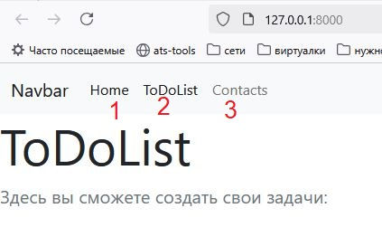
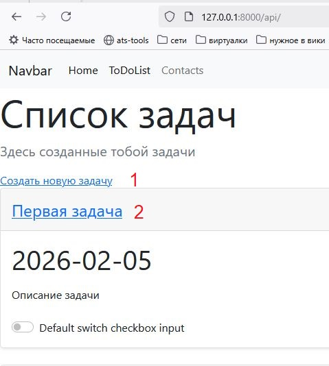
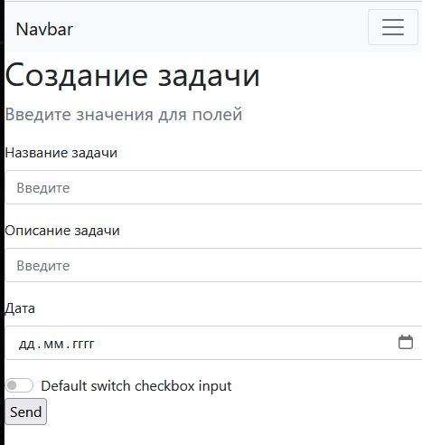

# Домашнее задание - 4

## Сделать веб-приложение на FastAPI

## Задание для выполнения
- [x] На основе `homework_05` создать представления. Создал список дел ToDoList, в котором можно создавать новые задачи, либо редактировать уже существующие.
      
1. app.py - основной файл, через который запускаем программу
2. routers директория - в которой описаны все наши методы и какие пути они обрабатывают
3. schemas директория - в которой описан класс хранения задач
4. templates директория - в которой хранятся html шаблоны с использованием Jinja2 
      
- [x] создание routers
1. routers/main_routers.py

    GET запросы

    index(/) - приветственная страница

    about(/about/) - информация о разработчике
2. routers/api_routers.py - пути с префиксом /api/
    GET запросы

    api_list(/) - выводится список всех задач

    read_item(/item/{id_item}) - посмотреть определенную задачу

    input_item(/new) - заполняем форму для новой задачи

    POST запросы

    job_create(/job_create) - создание новой задачи

    job_update(/{id_item}) - редактирование существующей задачи

- [x] база задач
    schemas/jobs.py

    Job - класс для наших задач, наследуется от класса BaseModel библиотеки Pydantic

## Запуск программы
Запускаем файл app.py и проходим по адресу http://127.0.0.1:8000

## Работа с программой
1. В Navbar выберите нужный пункт меню.
   1. Home - главная страница
   2. ToDoList - страница с нашими задачами
   3. Contacts - страница о разработчике

2. Если перейти в ToDoList, тут отображается весь список задач.
   1. Ссылка на создание новой задачи
   2. Ссылка на редактирование существующей задачи

3.  В создании задачи нужно заполнить все поля и нажать Send. При редактировании задачи, все поля заполнять не обязательно. В незаполненных полях останутся прежние значения.

